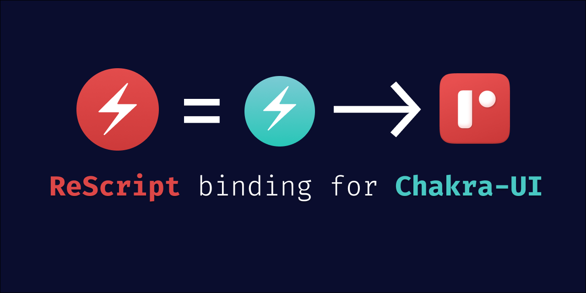

<p align="center">
  
  <br />
  <br />
  <a href="#installation">Installation</a> // <a href="#example">Example</a> // <a href="#contribution">Contribution</a> // <a href="#acknowledgement">Acknowledgement</a>
</p>

## ToC

<!-- vim-markdown-toc GFM -->

- [Installation](#installation)
- [Example](#example)
- [Docs](#docs)
  - [Style Props](#style-props)
  - [Component](#component)
    - [Layout](#layout)
    - [Forms](#forms)
    - [Data Display](#data-display)
    - [Feedback](#feedback)
    - [Typography](#typography)
    - [Overlay](#overlay)
    - [Disclosure](#disclosure)
    - [Navigation](#navigation)
    - [Media and Icons](#media-and-icons)
    - [Others](#others)
    - [Hooks](#hooks)
- [Contribution](#contribution)
  - [Make a Pull Request](#make-a-pull-request)
  - [Make a new component binding](#make-a-new-component-binding)
- [Acknowledgement](#acknowledgement)

<!-- vim-markdown-toc -->

## Installation

Run the following in your favorit console:

```console
yarn add rescript-chakra
```

**OR**

```console
npm install --save rescript-chakra
```

**Don't forget** install dependencies requirements of `@chakra-ui/react` (Skip when exist)

```console
yarn add @chakra-ui/react @emotion/react@^11 @emotion/styled@^11 framer-motion@^4
```

**OR**

```console
npm i @chakra-ui/react @emotion/react@^11 @emotion/styled@^11 framer-motion@^4
```

Then, add `rescript-chakra` in your `bsconfig.json`:

```diff
-- "bs-dependencies": [],
++ "bs-dependencies": [rescript-chakra],
```

## Example

- following `chakra-ui` example [**here**](https://chakra-ui.com/docs/features/style-props#margin-and-padding)

```javascript
// JavaScript 🟨 | TypeScript 🟦
import { Box } from "@chakra-ui/react"
// m={2} refers to the value of `theme.space[2]`
<Box m={2}>Tomato</Box>
// You can also use custom values
<Box maxW="960px" mx="auto" />
// sets margin `8px` on all viewports and `16px` from the first breakpoint and up
<Box m={[2, 3]} />

// ReScript 🟥
open Chakra
@react.component
let make = () => <>
  // m={2} refers to the value of `theme.space[2]`
  <Box m={#2}> {"Tomato"->React.string} </Box>
  // You can also use custom values
  <Box maxW={#px(960)} mx=#auto />
  // sets margin `8px` on all viewports and `16px` from the first breakpoint and up
  <Box m={#array([#2, #3])} />
</>
```

Or you can check this [**Example**](https://github.com/ri7nz/rescript-chakra/tree/main/examples).

# Docs

All of Binding for Chakra-UI isn't completed, if you want to support this project, see the list below 🙌.

## Style Props

This is following and closely same with Chakra-UI. [**See Style Props**](https://chakra-ui.com/docs/features/style-props#reference) and Implemented typed **Props** with typed **CSS-Properties** use [bs-css](https://github.com/giraud/bs-css/blob/cb242dbd08a00bd848faecb756a9ddce68d8707a/bs-css/src/Css_AtomicTypes.rei).

- [x] [Margin and Padding](https://chakra-ui.com/docs/features/style-props#margin-and-padding)
- [x] [Color and Background Color](https://chakra-ui.com/docs/features/style-props#color-and-background-color)
- [x] [Gradient](https://chakra-ui.com/docs/features/style-props#gradient)
- [x] [Layout width and height](https://chakra-ui.com/docs/features/style-props#layout-width-and-height)
- [x] [Flexbox](https://chakra-ui.com/docs/features/style-props#flexbox)
- [x] [Grid Layout](https://chakra-ui.com/docs/features/style-props#grid-layout)
- [x] [Background](https://chakra-ui.com/docs/features/style-props#background)
- [x] [Borders](https://chakra-ui.com/docs/features/style-props#borders)
- [x] [Border Radius](https://chakra-ui.com/docs/features/style-props#border-radius)
- [x] [Position](https://chakra-ui.com/docs/features/style-props#position)
- [x] [Shadow](https://chakra-ui.com/docs/features/style-props#shadow)
- [x] [Pseudo](https://chakra-ui.com/docs/features/style-props#pseudo)
- [ ] [Other Style Props](https://chakra-ui.com/docs/features/style-props#other-props) 🚧 (_Partially Implemented_)

All of Style Props implementation is write in File:[Chakra\_\_MakeProps.res](https://github.com/ri7nz/rescript-chakra/blob/main/src/Interfaces/Chakra__MakeProps.res)

## Component

### Layout

- [x] Aspect Ratio
- [x] Box
- [x] Center
  - [x] Square
  - [x] Circle
- [x] Container
- [x] Flex
  - [ ] Spacer
- [x] Grid
  - [ ] GridItem
- [x] SimpleGrid
- [x] Stack
  - [x] VStack
  - [x] HStack
- [x] Wrap
  - [x] WrapItem

### Forms

- [x] Button
  - [x] Button Group
- [ ] Checkbox
- [ ] Editable
- [ ] Form Control
- [ ] Icon Button
- [x] Input
  - [x] InputGroup
  - [x] InputLeftAddon
  - [x] InputRightAddon
  - [x] InputLeftElement
  - [x] InputRightElement
- [ ] Number Input
- [ ] Pin Input
- [ ] Radio
- [x] Select
- [ ] Slider
- [ ] Switch
- [ ] Textarea

### Data Display

- [x] Badge
- [x] Close Button
- [x] Code
- [x] Divider
- [x] Kbd
- [ ] List
  - [ ] ListItem
  - [ ] ListIcon
  - [ ] OrderedList
  - [ ] UnorderedList
- [x] Stat
  - [x] StatGroup
  - [ ] StatLabel
  - [ ] StatHelpText
  - [ ] StatNumber
  - [ ] StatArrow
- [ ] Table
  - [ ] Thead
  - [ ] Tbody
  - [ ] Tfoot
  - [ ] Tr
  - [ ] Th
  - [ ] Td
  - [ ] TableCaption
- [ ] Tag
  - [ ] TagLabel
  - [ ] TagLeftIcon
  - [ ] TagRightIcon
  - [ ] TagCloseButton

### Feedback

- [ ] Alert
- [x] Circular Progress
  - [x] Circular Progress Label
- [x] Progress
- [x] Skeleton
  - [x] SkeletonText
  - [x] SkeletonCircle
- [x] Spinner
- [x] Toast
  - [x] useToast
  - [x] createStandaloneToast

### Typography

- [x] Text
- [x] Heading

### Overlay

- [ ] Alert Dialog
- [ ] Drawer
- [ ] Menu
- [ ] Modal
- [ ] Popover
- [ ] Tooltip

### Disclosure

- [ ] Accordion
- [ ] Tabs
- [ ] Visually Hidden

### Navigation

- [x] Breadcrumb
  - [x] BreadcrumbItem
  - [x] BreadcrumbLink
  - [x] BreadcrumbSeparator
- [x] Link
- [x] LinkBox
  - [x] LinkOverlay

### Media and Icons

- [x] Avatar
  - [x] AvatarGroup
- [x] Icon
- [x] Image

### Others

- [x] Portal
- [x] Transitions
  - [x] Fade
  - [x] ScaleFade
  - [x] Slide
  - [x] SlideFade
  - [x] Collapse

### Hooks

- [ ] useBoolean
- [ ] useBreakpointValue
- [ ] useClipboard
- [ ] useControllable
- [ ] useDisclosure
- [ ] useMediaQuery
- [ ] useMergeRefs
- [ ] useOutsideClick
- [ ] usePrefersReducedMotion
- [ ] useTheme
- [ ] useToken

# Contribution

## Make a Pull Request

- Please, refer with [conventionalcommits.org](https://www.conventionalcommits.org) for write `commit` message.

## Make a new component binding

I'm use [hygen.io](https://hygen.io) for generate new component binding base on `Box.res`, see [\_templates/Box/new/new.ejs.t](https://github.com/ri7nz/rescript-chakra/blob/main/_templates/Box/new/new.ejs.t)
USAGE:

- basic

```console
hygen Box new --name Name
```

- create `<Flex />`

```console
hygen Box new --name Flex
```

# Acknowledgement

- [**chakra-ui/chakra-ui**](https://github.com/chakra-ui/chakra-ui) ⚡️ Simple, Modular & Accessible UI Components for your React Applications
- [**giraud/bs-css**](https://github.com/giraud/bs-css) Statically typed DSL for writing css in reason.
